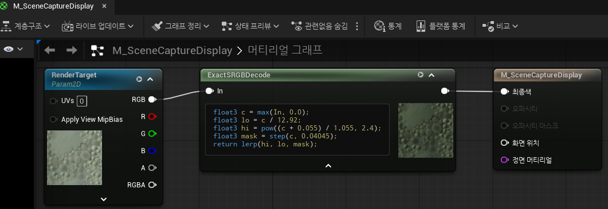
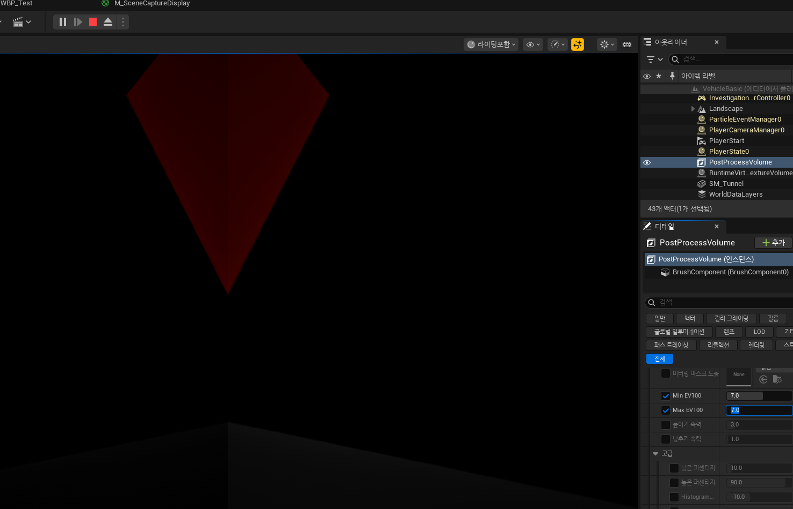
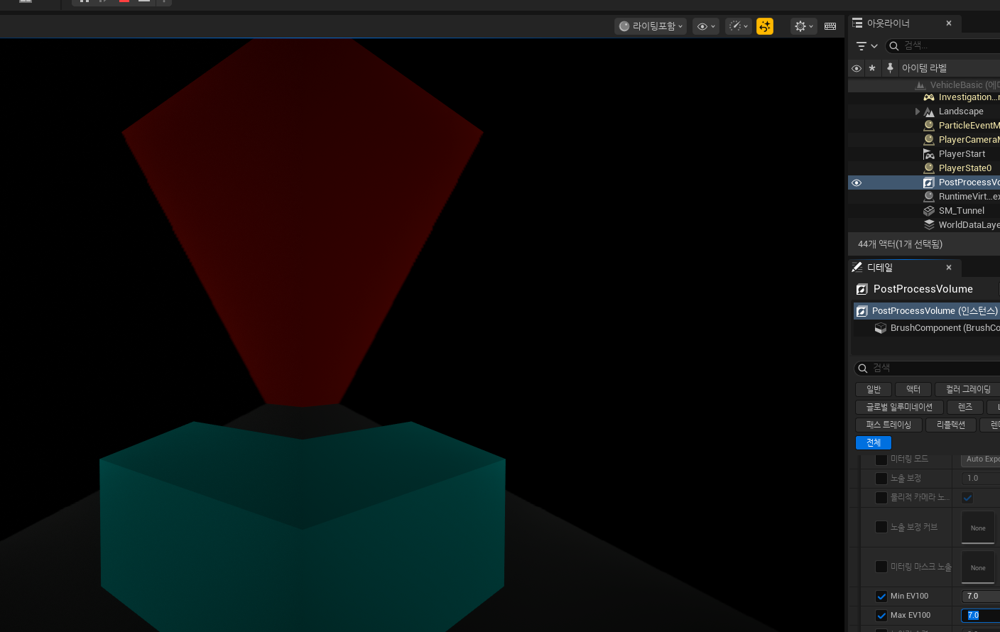

# 씬캡쳐 vs 실제 렌더링 색감/음영 불일치 — 완전 해결 기록 (2026-07-24 조사 시작 → 2026-07-26 완전 해결)

> `titan_example` 프로젝트. TitanTruck RCWS/UAV 짐벌/QuadCam 씬캡쳐 화면이 실제 렌더링보다 색이
> 진하고 그림자가 어둡게(또는, 잘못 고친 중간 단계에서는 반대로 살짝 밝게) 나오던 문제.
>
> **2026-07-26, 완전히 해결됨 — `AutoExposureBias` 등 어떤 사후 보정값도 없이 씬캡쳐와 실제
> 렌더링이 완전히 동일하게 나온다.** 회색/빨강뿐 아니라 민트색 등 임의의 색상으로도 검증 완료.
>
> 최종 원인은 완전히 독립적인 세 개가 겹쳐 있었다:
> 1. **엔진이 모든 씬캡쳐의 Lumen GI/Reflections를 기본적으로 강제 OFF시킴** — 뷰마다 독립적으로
>    수렴하는 게 아니라, **간접광 계산 자체가 한 번도 돈 적이 없었음.**
>   - titan example 에서는 강제로 lumen 을 켜서 이전에 해결.
> 2. **`UTextureRenderTarget2D::GetDisplayGamma()`를 서로 다른 목적으로 읽는 두 시스템(Slate의
>    UImage 인코딩 / 톤매퍼 자체의 감마 커브 적용)이 정반대의 값을 원함** — 한쪽을 고치면 다른
>    쪽이 깨지는 구조적 충돌이었고, **렌더타겟 프로퍼티 하나로는 절대 둘 다 만족시킬 수 없었다.**
>    진짜 해결은 렌더타겟 프로퍼티가 아니라 *렌더타겟을 화면에 그리는 방식 자체*를 바꾸는 것이었다
>    (텍스처 브러시 → 머티리얼 브러시, `M_SceneCaptureDisplay`).
> 3. 텍스처 스트리밍 미등록 (해상도 문제, 색감과 무관, 1절)
>
> 이 문서는 두 라운드의 조사를 거쳤다: 2026-07-24에 1번을, 2026-07-26 오전에 2번의 "절반"
> (`bForceLinearGamma=true`+`RTF_RGBA16f`)을 고쳤다고 착각했다가, 같은 날 오후 재검증 과정에서
> **그 "절반짜리 수정"도 실은 또 다른 형태로 틀렸다는 것**을 발견하고 진짜 원인(2번)을 완전히
> 규명해서 고쳤다. 아래 각 절에 "당시엔 맞다고 믿었지만 나중에 틀린 것으로 밝혀짐" 기록을 접은
> `<details>` 블록으로 그대로 남겨뒀다 — 오답에 빠졌던 경위 자체가 다음에 비슷한 버그를 만났을 때
> 유용한 교훈이기 때문.

---

## TL;DR (최종)

1. **Lumen GI/Reflections가 씬캡쳐에서 기본적으로 완전히 꺼져 있었음.**
   `SceneCaptureRendering.cpp`의 `SetupViewFamilyForSceneCapture()`에 다음이 있다:
   ```cpp
   // By default, Lumen is disabled in scene captures, but can be re-enabled with the post
   // process settings in the component.
   View->FinalPostProcessSettings.DynamicGlobalIlluminationMethod = EDynamicGlobalIlluminationMethod::None;
   View->FinalPostProcessSettings.ReflectionMethod = EReflectionMethod::None;
   View->FinalPostProcessSettings.LumenSurfaceCacheResolution = 0.5f;
   ```
   엔진이 **의도적으로, 명시적으로** 모든 씬캡쳐의 Lumen을 기본 OFF로 강제한다(성능 때문으로 보임 —
   거울/보안카메라 등 저비용 용도가 씬캡쳐의 주 사용처). `ShowFlags`로는 전혀 제어 안 되는, 완전히
   별개의 메커니즘이라 찾기 어려웠다.
   **고침**: `SightCamera`/`GimbalCamera`/QuadCam 4개 카메라 전부 `SyncLensFromCineCamera(s)`에서
   매 틱 `bOverride_DynamicGlobalIlluminationMethod=true`+`Lumen`,
   `bOverride_ReflectionMethod=true`+`Lumen`을 강제.

2. **`GetDisplayGamma()`를 읽는 두 시스템의 목적 충돌 (진짜 최종 원인).**
   `UTextureRenderTarget2D::GetDisplayGamma()`(`TextureRenderTarget2D.cpp`) 하나의 값을 서로
   무관한 두 곳이 정반대 의미로 읽는다:
   - **Slate** (`SlateRHIRenderingPolicy.cpp`): `UImage` 브러시로 텍스처를 그릴 때
     `GetDisplayGamma()==1.0`이면 "이미 디스플레이용으로 인코딩 끝났다, 다시 건들지 마"로 해석해서
     아무것도 안 하고, `!=1.0`이면 자체적으로 감마 인코딩을 한 번 더 건다. (`SViewport`에는
     `bEnableGammaCorrection`이라는 탈출구가 있지만 `UImage`엔 없음.)
   - **톤매퍼 자체** (`PostProcessTonemap.cpp`의 `GetTonemapperOutputDeviceParameters()` →
     `PostProcessCombineLUTs.usf`의 Filmic 경로: `pow(FilmColorNoGamma, InverseGamma.y)`,
     `InverseGamma.y = 2.2 / GetDisplayGamma()`): `GetDisplayGamma()==1.0`이면 "이 렌더타겟은
     아직 감마 커브가 하나도 안 씌워졌다, 여기서 내가 직접 `pow(x, 2.2)`를 걸어줘야 한다"로
     해석한다. 실제 뷰포트 백버퍼는 `GetDisplayGamma()~=2.2`라서 `InverseGamma.y=1.0`이 되어
     이 단계가 아무 일도 안 하고 지나간다.

   즉 **`bForceLinearGamma=true`(또는 float 포맷)로 `GetDisplayGamma()`를 1.0으로 만들면 Slate
   쪽은 고쳐지지만, 그 순간 톤매퍼가 실제 뷰에는 없는 `pow(x, 2.2)`를 씬캡쳐 색상에만 추가로
   걸어버린다.** `pow(x, 2.2)`는 x가 1(밝음/직사광)에 가까울수록 거의 안 변하고 x가 작을수록
   (그림자·어두운 노출) 급격히 더 어두워지는 곡선이라, "그림자만 유독 어둡고 EV100을 올릴수록
   (전체를 어둡게 할수록) 차이가 커지는" 정확히 그 증상을 만든다 — Lumen을 완전히 꺼도, 노출을
   완전히 고정해도 사라지지 않는 이유가 이것.

   **`GetDisplayGamma()` 하나로는 이 두 시스템을 동시에 만족시킬 방법이 없다** (하나는 1.0을
   원하고 하나는 ~2.2를 원함). 그래서 렌더타겟 프로퍼티가 아니라 **렌더타겟을 화면에 그리는
   방식**을 바꿔서 해결했다:
   - 렌더타겟은 `RenderTargetFormat=RTF_RGBA8`, `bForceLinearGamma=false`, `SRGB=true`로
     되돌린다 → `GetDisplayGamma()~=2.2`가 되어 **톤매퍼가 실제 뷰와 완전히 동일하게 동작**한다
     (`InverseGamma.y=1.0`, 추가 `pow` 없음).
   - 대신 UMG에서 이 렌더타겟을 **일반 텍스처 브러시가 아니라 머티리얼 브러시**로 표시한다
     (`M_SceneCaptureDisplay`, `/Game/UI/Materials/`). 머티리얼은 자기만의 컴파일된 셰이더로
     텍스처를 샘플링하기 때문에 `SlateRHIRenderingPolicy`의 `GetDisplayGamma()` 기반 자동
     재인코딩 경로를 아예 타지 않는다 — 그 대신 머티리얼 안에서 **명시적으로** sRGB 디코드를
     한 번 해준다 (`UTextureRenderTarget2D::SRGB` 플래그는 실제 GPU 리소스에는 전혀 반영 안 되는
     죽은 프로퍼티라서 — `TextureRenderTarget2D.cpp` 주석: *"Resource has a bSRGB field which is
     not set or checked in the RenderTarget code"* — 하드웨어 자동 디코드에 의존할 수 없기
     때문). 이렇게 하면 톤매퍼(1번 인코딩) → 머티리얼의 명시적 디코드(1번 디코드) → UI
     컴포지팅이 정확히 한 번씩만 걸려서, 두 시스템이 서로 다른 값을 원하는 충돌 자체가 사라진다.

   

   머티리얼 안의 sRGB 디코드는 단순 `pow(x, 2.2)` 근사가 아니라 **정확한 sRGB 피스와이즈
   커브**(어두운 영역은 선형 구간)로 구현했다 — 단순 `pow(2.2)` 근사만으로도 대부분 맞지만
   미세한 잔차가 남았고(EV100을 극단적으로 올렸을 때 실제 렌더링이 아주 살짝 더 밝게 보임),
   정확한 커브로 바꾸자 그 잔차까지 완전히 사라졌다.
   ```hlsl
   float3 c = max(In, 0.0);
   float3 lo = c / 12.92;
   float3 hi = pow((c + 0.055) / 1.055, 2.4);
   float3 mask = step(c, 0.04045);
   return lerp(hi, lo, mask);
   ```

3. **텍스처 스트리밍 등록 누락 (2026-07-24, 여전히 유효, 색감과는 무관).** 씬캡쳐가 텍스처
   스트리밍 시스템에 자기 위치를 전혀 등록 안 함 — 해상도/선명도 문제. 고침, 유지. (1절)

4. **최종 결과**: 위 1, 2번을 전부 고치자 `AutoExposureBias` 등 어떤 사후 보정값도 필요 없이
   씬캡쳐와 실제 렌더링이 완전히 동일하게 나왔다 — 회색/빨강뿐 아니라 민트색 큐브로도 재검증
   완료(사용자 실측 확인, 2026-07-26).

   변경 전 (ev100 7 고정)
   

   변경 후 (ev100 7 고정, 중간에 민트색 cube 추가)
   
---

## 1. 텍스처 스트리밍 등록 누락 (해결, 유지)

### 발견
엔진 전체에서 `AddStreamingViewInfo()`(뷰 위치를 텍스처 스트리밍 매니저에 등록)를 호출하는
곳은 `GameViewportClient.cpp`의 `Draw()` **단 한 곳뿐**(`UnrealClient.cpp`/헤더 제외 실호출
0건). 이건 **실제 `ULocalPlayer` 뷰에만 해당** — `SceneCaptureComponent2D`는 완전히 다른 렌더
경로(`SceneCaptureRendering.cpp`)를 타서 이 등록을 원천적으로 안 함. 즉 씬캡쳐가 보고 있는
텍스처가 메인뷰 근처에서 우연히 안 겹치면 **가장 낮은 밉레벨로 방치됨.**

웹 검색으로도 독립 확인: "Unreal's streaming system mostly only cares about game viewport
clients... Scene Capture Component 2D... they'll end up getting the lowest possible mipmap
only" ([Epic 포럼](https://forums.unrealengine.com/t/texture-streaming-from-scenecapture2d/408966),
[SteveStreeting.com](https://www.stevestreeting.com/2024/07/24/fixing-blurry-textures-in-ue-capture-components/)).

### 수정
`RCWSComponent.cpp`(`TickComponent`)/`UAVPawn.cpp`(`Tick`)에 `CaptureScene()` 직전, 메인뷰가
`GameViewportClient::Draw()`에서 하는 것과 동일한 계산으로 매 틱 수동 등록 추가:
```cpp
const float HorizontalFOVRadians = FMath::DegreesToRadians(SightCamera->FOVAngle);
const float ScreenSize = static_cast<float>(SightRenderTarget->SizeX);
const float FOVScreenSize = ScreenSize / FMath::Tan(HorizontalFOVRadians * 0.5f);
const float StreamingScale = 1.f / FMath::Clamp(SightCamera->LODDistanceFactor, 0.2f, 1.f);
IStreamingManager::Get().AddViewInformation(SightCamera->GetComponentLocation(), ScreenSize, FOVScreenSize, StreamingScale);
```
**색감/음영과는 무관한 별개 축**(해상도/선명도 문제) — 확인 완료, 유지.

---

## 2. 렌더타겟 감마/디스플레이 인코딩 버그 — 최종 원인 및 해결

> 이 절은 두 번 틀렸다가 세 번째에 진짜 원인을 찾았다. 아래 두 개의 접은 블록은 각각
> "이중 감마"라는 진단까지는 맞았지만 최종 결론이 틀렸던 두 번의 실패 기록이다. **진짜 정답은
> 위 TL;DR 2번 참고.**

<details>
<summary>1차 시도 (2026-07-24): "bForceLinearGamma=false가 정답" — 틀림</summary>

`SCS_FinalColorLDR`는 톤매핑+감마 인코딩까지 이미 적용된 최종 이미지이므로
`bForceLinearGamma=false`가 맞다고 결론 냈었다. 당시 Lumen이 완전히 꺼져 있어서 전체적으로
어두웠던 상태 + `AutoExposureBias=-1.0` 보정이 우연히 이중 감마로 인한 과다노출을 어느 정도
상쇄해준 상태에서 "95% 맞다"고 판단한 것이었다 — 실제로는 이중 감마가 그대로 남아있었다.

</details>

<details>
<summary>2차 시도 (2026-07-26 오전): "bForceLinearGamma=true + RTF_RGBA16f가 정답" — 이것도 틀림</summary>

Slate가 `UImage`로 텍스처를 그릴 때 `GetDisplayGamma()` 기준으로 자체적으로 한 번 더 감마
인코딩을 건다(`SlateRHIRenderingPolicy.cpp`)는 진단까지는 맞았다. `bForceLinearGamma=true`로
바꿔서 `GetDisplayGamma()`가 1.0을 반환하게 만들면 Slate의 재인코딩이 없어지니 문제가
해결된다고 결론 냈다. 다만 8비트 정수 포맷에 리니어 값을 그대로 저장하면 그림자/GI 디테일의
정밀도가 뭉개지는 새 문제가 생겨서(감마 인코딩은 원래 어두운 영역에 비트를 더 배분해주는 역할도
하기 때문), 렌더타겟 포맷을 `RTF_RGBA8` → `RTF_RGBA16f`(float, 정밀도 손실 없음)로 같이 바꿨다.

titan_example에 적용 직후엔 완벽해 보였다(사용자 확인, "노출조정 없이도 완벽하게 똑같은
퀄리티로 보여"). **그런데 나중에 titan_example을 다시 켜보니 예전 증상이 재발한 것처럼
보였고**, 재조사 결과 사실 이 "완벽했던" 순간은 착시였다 — 밝은 노출값에서는 문제가 클리핑에
가려 안 보였을 뿐, 노출을 낮춰서(EV100을 올려서) 다시 보니 그림자 영역에서 씬캡쳐가 계속 더
어둡게 나오는 게 확인됐다. 원인은 `bForceLinearGamma=true`가 Slate 쪽 문제는 고쳤지만,
**톤매퍼 자체의 감마 커브 적용 로직에 새로운 문제를 만들고 있었기 때문**(TL;DR 2번 참고) —
`RTF_RGBA16f`로 정밀도 손실을 없앤 건 사실이었지만, 애초에 "리니어 값을 저장해야 한다"는
전제 자체가 틀렸다.

</details>

---

## 3. ~~뷰별 독립 Lumen GI / 노출~~ — 결론이 틀렸음, 정정함

> **2026-07-24의 이 절 전체 결론("구조적으로 해결 불가능")은 틀렸다.** 아래 원본 기록은 "왜 틀린
> 결론에 도달했는지" 참고용으로만 남겨둔다. 실제로는 Lumen 씬 데이터가 뷰마다 "다르게 수렴"한 게
> 아니라, 씬캡쳐 쪽 Lumen이 **애초에 완전히 꺼져 있었다** (1절 TL;DR, 5절 참고).
>
> (2026-07-26 오후 추가 확인: `SceneCaptureRendering.cpp`에서 Lumen GI/Reflection이 켜져 있는
> 씬캡쳐는 `FSceneViewState::AddLumenSceneData()`를 통해 메인뷰의 `DefaultLumenSceneData`와는
> **별개의, 자기 전용 `FLumenSceneData` 인스턴스**를 갖는다는 것도 확인했다 — 메인뷰 걸 최초 1회
> 복사해서 시작한 뒤로는 독립적으로 갱신된다. 이 메커니즘 자체는 실재하지만, 최종적으로 확인한
> 결과 이번 증상의 원인은 아니었다 — 원인은 TL;DR 2번의 `GetDisplayGamma()` 충돌이었고, 그 증거로
> **Lumen을 양쪽 다 완전히 꺼도, 심지어 직사광만 받는 벽에서도 동일한 증상이 재현됐다.**)

<details>
<summary>2026-07-24 원본 기록 (결론은 틀렸지만 조사 과정 참고용으로 보존)</summary>

### 3.1 독립 Lumen 씬 데이터 — 공유할 방법이 없음
`SceneViewState.h:100-102` 주석: *"Cube map captures share an origin, allowing them to share
things like global distance fields and Lumen scene data. Otherwise, this will just be the same
as UniqueID."* 실제 공유 코드(`SceneCaptureComponent.cpp:414`)는 큐브맵 캡쳐 6면끼리만 공유 —
일반 2D 캡쳐가 메인뷰와 공유할 경로는 엔진에 아예 없음.

(참고: 이 사실 자체는 여전히 맞다 — 다만 "그래서 수렴 결과가 달라진다"가 이번 증상의 실제
원인은 아니었다는 게 나중에 밝혀짐. Lumen 자체가 안 돌고 있었으니 "다르게 수렴"할 대상 자체가
없었다.)

### 3.2 독립 노출(PreExposure) 히스토리
`FViewInfo::UpdatePreExposure()`가 뷰스테이트마다 독립 관리 — 이것도 사실이지만, 2026-07-26
재조사에서 노출값을 강제로 고정(`AutoExposureMinBrightness=MaxBrightness`)해도 증상이 전혀
안 바뀌는 것으로 확인되어 이번 증상의 원인에서 제외됨.

### 3.3 결정적 실험 — 사용자가 직접 확인 (2026-07-24, 재해석 필요)
- HDRI/Skylight 강도 0 + PostProcessVolume EV100 락 해제 + 오토익스포저 자유 → 그림자 음영 차이는
  여전히 존재.
- 광원 색을 어둡게 → 색감 진해짐, 어두운 부분 더 어두워짐.

**2026-07-26 재해석**: 이 실험들은 Lumen이 꺼진 상태에서 진행됐다. Lumen 없이 직사광만 있는
상태에서 광원 세기/색을 바꾸면 당연히 결과가 바뀌므로, 이 실험이 "독립 Lumen 수렴"을 증명한 게
아니라 그냥 "직사광 세팅이 최종 그림에 영향을 준다"는 당연한 사실을 보여준 것이었다.

</details>

---

## 4. ~~최종 조치 — 오토익스포저 바이어스 보정~~ (더 이상 필요 없음, 제거함)

> 2026-07-24 당시 최종 조치였던 `AutoExposureBias=-1.0`은 **2026-07-26 근본 원인 수정 후 완전히
> 제거했다.** 진짜 원인(Lumen 완전 비활성화 + `GetDisplayGamma()` 이중 용도 충돌)을 고치고 나니
> 사후 보정 없이도 두 렌더링이 동일하게 나왔다 — 이 보정값은 여러 버그가 만든 오차를 우연히
> 부분적으로만 상쇄해주던 미봉책이었을 뿐, 애초에 정확한 값을 낼 수 있는 방법이 아니었다.

---

## 5. 최종 원인 규명 경위 (2026-07-26)

### 5.1 배경
2026-07-24 조사 이후에도 titan_example 자체에서는 색감 차이가 완전히 안 잡혀서(`AutoExposureBias`로
95% 정도만 맞춰둔 상태), 문제를 titan_example의 복잡한 대시보드/차량 로직에서 분리해서 볼 수 있는
**최소 재현 환경**이 필요했다. `C:\working\mine\testvehicle`(UE 5.8 Vehicle Template 기반, 완전히
새로운 일회용 샌드박스 프로젝트)에 자유이동 카메라 폰 하나로 화면 오른쪽엔 그 폰의 실제 렌더링,
왼쪽엔 정확히 같은 위치/방향을 보는 씬캡쳐를 나란히 띄우는 재현 환경을 새로 만들었다(unreal-mcp로
Claude Code가 직접 C++ 작성 + 에디터 조작).

### 5.2 1라운드 — Lumen 비활성화 + "절반짜리" 감마 수정
1. 처음엔 titan의 2026-07-24 설정(`bForceLinearGamma=false`, `RTF_RGBA8`) 그대로 시작 → 왼쪽
   (씬캡쳐)이 하얗게 뜨는 것 확인. 엔진소스(`SlateRHIRenderingPolicy.cpp`)를 뒤져서 Slate가
   `UImage`에 자체 감마 인코딩을 한 번 더 건다는 것을 발견 — 이중 감마 확정.
2. `bForceLinearGamma=true`로 바꾸니 흰색 문제는 사라졌지만 이번엔 반대로 어둡고 색감이 진해짐
   (8비트 정수 포맷에 리니어 저장하면서 정밀도 손실) → `RTF_RGBA16f`(float)로 포맷도 같이 바꿔서
   해결(된 것처럼 보였음).
3. Lumen이 씬캡쳐에서 기본 OFF라는 것을 발견(`SceneCaptureRendering.cpp::SetupViewFamilyForSceneCapture()`)
   하고 강제 on으로 수정 → 그림자에 바운스광이 들어오며 실제 렌더링과 일치.
4. titan_example의 `RCWSComponent.cpp`/`UAVPawn.cpp`/`QuadCamComponent.cpp`에 동일 수정 적용 →
   사용자가 "완벽하게 똑같다"고 확인.

### 5.3 2라운드 — 재발, 그리고 진짜 원인 발견
5. 나중에 titan_example을 다시 켜보니 색감 차이가 다시 보인다는 사용자 보고 → 재조사 시작.
   샌드박스에서도 같은 증상이 재현됨을 확인(밝은 노출에서는 클리핑에 가려 안 보였을 뿐).
6. `bMainViewResolution`/TSR 상속, Lumen 전용 별개 씬데이터(`AddLumenSceneData`) 등 여러
   가설을 세우고 하나씩 코드로 검증했으나 전부 기각 — 특히 **Lumen을 완전히 꺼도, 순수 노출을
   ISO/셔터/조리개 기반 Manual 모드로 완전히 고정해도** 씬캡쳐가 계속 더 어둡게 나옴을 확인 —
   Lumen도 노출도 원인이 아니라는 게 명확해짐.
7. "EV100을 올릴수록(어둡게 할수록) 차이가 커지고, 직사광 받는 벽은 거의 안 다친다"는 사용자의
   정밀 관찰이 결정적 단서였음 — 감마 커브 관련 곱셈성 오차의 전형적 시그니처. 톤매퍼 소스
   (`PostProcessTonemap.cpp`, `PostProcessCombineLUTs.usf`)를 다시 파다가
   `GetTonemapperOutputDeviceParameters()`가 `GetDisplayGamma()`를 읽어서
   `pow(FilmColorNoGamma, InverseGamma.y)`를 적용한다는 것을 발견 — `bForceLinearGamma=true`가
   Slate 문제는 고쳤지만 **이 톤매퍼 단계에 실제 뷰에는 없는 `pow(x, 2.2)`를 추가하고 있었다**
   (TL;DR 2번 참고).
8. 렌더타겟을 `RTF_RGBA8`/`bForceLinearGamma=false`(=톤매퍼가 실제 뷰와 동일하게 동작)로
   되돌리고, 대신 UMG 표시 방식을 텍스처 브러시 → 머티리얼 브러시(`M_SceneCaptureDisplay`)로
   바꿔서 Slate의 자동 재인코딩 경로 자체를 우회 → 처음엔 머티리얼에 넣은 디코드 노드가
   실제로는 감마 디코드가 아니라 색역(gamut) 변환 노드였던 실수가 있었으나(밝기 변화 없음으로
   확인), `Power(x, 2.2)` 근사 디코드로 교체하자 거의 일치, **정확한 sRGB 피스와이즈 디코드
   커브**로 교체하자 완전히 일치 — 회색/빨강/민트색 전부 좌우 완전 동일 확인.
9. titan_example의 3개 렌더타겟 파일(`RCWSComponent.cpp`/`UAVPawn.cpp`/`QuadCamComponent.cpp`)과
   4개 위젯 헬퍼 파일(`Monitor1Widget.cpp`/`Monitor2Widget.cpp`/`MissionDashboardWidget.cpp`/
   `QuadCamUIWidget.cpp`)에 동일 수정 적용, `M_SceneCaptureDisplay` 머티리얼을
   `/Game/UI/Materials/`에 신규 생성 → **사용자가 titan_example에서 직접 확인, 완전히
   해결됨(2026-07-26).**

### 5.4 교훈
- 겉보기에 "완벽하게 고쳐졌다"고 확인한 것도, 특정 노출값·특정 색상에서만 클리핑 등으로 오차가
  가려져 있었을 뿐일 수 있다 — 노출을 의도적으로 극단까지 바꿔보고, 다양한 색상(민트색 큐브 등)
  으로 재검증하는 과정이 진짜 결정적이었다.
- 렌더타겟의 프로퍼티 하나(`GetDisplayGamma()`가 반환하는 값)를 **서로 무관한 두 시스템이 각자
  다른 목적으로 읽고 있을 수 있다** — 한쪽 문제를 고치는 값이 다른 쪽엔 새 문제를 만들 수 있다는
  걸 놓치기 쉽다. 이런 구조적 충돌은 프로퍼티를 조정하는 걸로는 근본적으로 못 푼다 — 두 시스템 중
  하나가 그 프로퍼티를 아예 안 보게 만드는 것(머티리얼 브러시로 전환)이 진짜 해법이었다.
- "차이가 방향성 있게 일정하게 유지되는가, 노출/설정을 바꿔도 사라지지 않는가"라는 질문이
  Lumen(수렴 노이즈)과 감마 커브(곱셈성·결정론적 오차)를 구별하는 결정적 기준이 됐다 — 전자라면
  랜덤하게 방향이 바뀌어야 하는데, 실제로는 항상 같은 방향으로 일정하게 나타났다.
- `UTextureRenderTarget2D::SRGB` 프로퍼티는 실제 GPU 리소스 sRGB 뷰 생성에 전혀 반영되지 않는
  죽은 플래그다(`TextureRenderTarget2D.cpp` 자체 주석으로 확인) — 렌더타겟에 관해서는 "SRGB만
  true로 켜면 하드웨어가 알아서 디코드해준다"는 가정이 성립하지 않는다.

---

## 6. 최종 코드 상태 (2026-07-26)

- **`Vehicles/RCWSComponent.cpp`**, **`Vehicles/UAVPawn.cpp`**,
  **`Plugins/QuadCamModule/.../QuadCamComponent.cpp`** (3곳 전부 동일 패턴):
  - `SightRenderTarget`/`CameraRenderTarget`/QuadCam 4개 RT: `RenderTargetFormat = RTF_RGBA8`,
    `SRGB = true`(메타데이터용, 실제 GPU 리소스엔 영향 없음), `bForceLinearGamma = false`.
  - `SyncLensFromCineCamera(s)`(매 틱 호출)에서
    `bOverride_DynamicGlobalIlluminationMethod=true`/`DynamicGlobalIlluminationMethod=Lumen`,
    `bOverride_ReflectionMethod=true`/`ReflectionMethod=Lumen`,
    `bOverride_LumenSurfaceCacheResolution=true`/`LumenSurfaceCacheResolution=1.f` 유지.
  - `TickComponent()`/`Tick()`에 `IStreamingManager::Get().AddViewInformation(...)` 매 틱 호출 유지
    (1절, 변경 없음).
- **`/Game/UI/Materials/M_SceneCaptureDisplay`** (신규 머티리얼, `MD_UI`/`MSM_Unlit`): 텍스처
  파라미터 `RenderTarget` → 정확한 sRGB 디코드(Custom HLSL 노드, 피스와이즈 커브) → Emissive
  Color. 이 머티리얼 하나를 아래 4곳 전부가 공유한다.
- **`UI/Monitor1Widget.cpp`**, **`UI/Monitor2Widget.cpp`**, **`UI/MissionDashboardWidget.cpp`**,
  **`Plugins/QuadCamModule/.../QuadCamUIWidget.cpp`**: 각 파일의 `SetImageRenderTarget`류 헬퍼를
  "`FSlateBrush.SetResourceObject()`로 텍스처 브러시 직접 세팅" 방식에서 "`M_SceneCaptureDisplay`로
  `UMaterialInstanceDynamic` 생성 → `RenderTarget` 파라미터 세팅 →
  `Image->SetBrushFromMaterial()`" 방식으로 전환.
  - 참고: `TestSceneCapture.cpp`/`TestCaptureWidget.cpp`(회귀테스트용 스캐폴딩)는 여전히 기존
    텍스처 브러시 방식 — 프로덕션 경로가 아니라 의도적으로 안 건드림.
- **레벨/BP 쪽**: `RCWSSightCineCamera`(TitanTruck)/`GimbalCineCamera`(UAV)의 `AutoExposureBias`
  오버라이드 **제거함** — 더 이상 필요 없음.
- 참고용 재현 환경: `C:\working\mine\testvehicle`(UE 5.8 Vehicle Template 기반 샌드박스, unreal-mcp로
  구축) — 앞으로 비슷한 씬캡쳐/실제렌더링 비교 이슈가 생기면 titan_example 대신 여기서 먼저
  재현해보는 걸 권장. `AInvestigationCameraPawn`(왼쪽=씬캡쳐, 오른쪽=실제 렌더링, 서브렉트로 완전히
  동일한 위치/방향 보장)이 핵심 클래스. 여기도 동일하게 `RTF_RGBA8`/`bForceLinearGamma=false`+
  `M_SceneCaptureDisplay` 패턴으로 맞춰져 있다.

---

## 7. 이 조사에서 남는 열린 질문 (더 팔 수 있으면 참고)

- **왜 씬캡쳐의 뷰패밀리 생성 경로는 프로젝트의 "Lumen" 기본 GI 메서드 설정을 안 물려받는가** —
  `FSceneView::StartFinalPostprocessSettings()`(`SceneView.cpp`)는 `r.DynamicGlobalIlluminationMethod`
  CVar를 읽어서 모든 뷰(캡쳐 포함)에 동일하게 `Lumen`을 기본값으로 세팅하는 것까지는 확인함 — 그런데
  `SceneCaptureRendering.cpp`가 그 직후에 명시적으로 `None`으로 **덮어쓴다**(코드 주석에 "By
  default, Lumen is disabled in scene captures"라고 명시되어 있음). 즉 "상속이 안 되는"
  미스터리가 아니라 **의도적으로 다시 꺼버리는 코드가 존재**하는 것 — 이 자체는 정확히 확인됐고,
  더 팔 필요 없음.
- `bUseRayTracingIfEnabled`(씬캡쳐 기본 false, 하드웨어 RT Lumen 사용 여부)는 이번 증상의 원인이
  아니었던 것으로 확인됨(켜봐도 변화 없었음) — 다만 성능/품질상 real view와 맞춰두는 것 자체는
  유효하므로 코드에는 유지.
- Lumen GI/Reflection이 켜진 씬캡쳐가 갖는 **자기 전용 `FLumenSceneData`**(메인뷰와 완전히
  별개, `FSceneViewState::AddLumenSceneData()`)는 이번 증상의 원인은 아니었지만 실재하는
  메커니즘이다 — 장시간 실행 시 씬캡쳐 쪽 Lumen 씬이 메인뷰와 미세하게 다르게 수렴할 가능성은
  이론상 여전히 남아있다(이번엔 검증 범위 밖). 나중에 정말 미세한 잔차가 남는 것처럼 보이면
  이걸 먼저 의심해볼 것.
