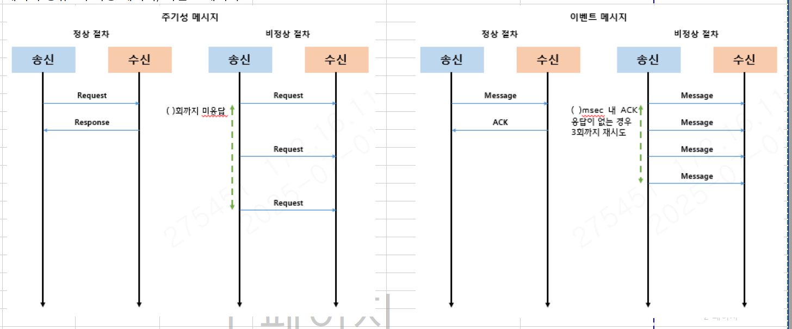

문의주신 내용에 대하여 답변 드립니다.

 

1. 시스템 전체 구성 및 역할

상위체계 ↔ 이동형 지휘소 SW ↔ UGV SW ↔ 통제기 간의 전체 연결 구조(아키텍처)가 어떻게 되는지 궁금합니다.

각 소프트웨어가 어떤 하드웨어(PC, 임베디드 보드 등)에서 구동되는지 알고 싶습니다.

각 구성요소의 역할과 책임 범위도 함께 알려주시면 작업에 도움이 될 것 같습니다.

 --> 시스템구성도를 ppt로 작성하여 전달드립니다. 첨부드리는 파일 참고 부탁드리겠습니다.

 --> 개발 대상 SW들은 PC 환경에서 구동됩니다.

 --> 각 SW별 역할은 다음과 같습니다.

   - 상위체계 : 전장 지휘통제

   - 이동형 지휘소 SW : UAV 제어 및 자체방호 RCWS 모사

   - UGV : UGV 이동 모사, 주행 영상 및 RCWS 모사

   - 통제기 : UGV 제어를 위한 신호 발생 및 UGV 상태 정보 수신

 

2. 네트워크 및 통신 방식

각 장비들은 동일한 LAN 환경에서 동작하는 구조인지 궁금합니다.

통신 프로토콜은 어떤 것을 사용할 예정인지(예: UDP, TCP, WebSocket, HTTP/gRPC 등) 정해진 사항이 있는지 궁금합니다.

영상 스트리밍이나 웹 기반 통신에 대해서도 사용해야 하는 프로토콜이나 방식이 정해져 있는지 알고 싶습니다.

 --> 각 장비들은 동일한 네트워크 대역에서 통신을 주고받습니다.

 --> UGV의 제어나 상태정보의 송수신 통신프로토콜은 UDP 기반 JSON String으로 이루어집니다.

 --> 영상 스트리밍은 RTSP 방식으로, 시뮬레이션이 RTSP 서버가 되어 시뮬레이션 영상이 필요한 곳에서 스트리밍 하는 방식으로 진행됩니다.

 

3. 하드웨어 사양

하드웨어 관련해서 전에 문의 드렸는데, 하드웨어 렌탈 전에

3D 렌더링 서버를 포함하여 각 컴퓨터(하드웨어)의 스펙

GPU, CPU, 메모리 등 필요한 최소/권장 사양이 있다면 공유 부탁드립니다.

 --> LIG에 납품한 장비 사양은 다음과 같습니다.

  - CPU : AMD 라이젠7 그래니트 9800X3D 

  - RAM : 16GB

  - GPU : RTX 5070 Ti

 

4. API 및 인터페이스 명세

시스템 간 통신에 대한 API 명세서가 있는지 궁금합니다.

요청(Request)/응답(Response) 형식, 데이터 포맷(JSON, Protobuf 등), 메시지 구조 등이 이미 정의되어 있는지 알고 싶습니다.

아직 명세가 없다면, 해당 부분은 구현 측에서 자유롭게 설계해도 되는지 궁금합니다.

 --> 인터페이스 명세 정의자료 전달드립니다.

 --> 정의에 따른 데이터 송수신 모듈은 내일 중으로 전달드리겠습니다.

 --> 금일 확인 한 내용으로는 아직 자체방호통제기에서 상위 체계로 가는 ICD 정의는 안되어있고, 향후 추가 여부도 LIG 검토중에 있습니다.

 

5. 구현 범위 및 자유도

기능 구현 시 반드시 따라야 하는 기술적 제약이나 개발 가이드가 있는지 궁금합니다.

반대로 구현 방식(내부 구조, 통신 방식, UI 구성 등)은 어느 정도까지 자유롭게 결정해도 되는지 알고 싶습니다.

기존에 반드시 연동해야 하는 모듈이나 재사용해야 하는 라이브러리, 프레임워크가 있다면 함께 알려주시면 감사하겠습니다.

 --> 별도로 전달받은 기술적 제약이나 개발 가이드는 없습니다.

 --> UI구성은 이전에 말씀드린바와 같이 B안 구조 + 전달드린 톤앤매너 구성으로 진행 부탁드립니다.

 

이상입니다.

 

시나리오 관련하여 배치는 정리되는대로 전달드리겠습니다.

# 통신 프로토콜
                            
1	전송 방식 : UDP ( 원격통제처리부 - 원격통제기 )						
2	프로토콜 : JSON						
3	데이터 종류 : 주기성 메시지, 이벤트 메시지						
                
                            
            
                            
4	메시지 구조						
    {						
        cmd :	Comand Code				
        src :	device				
        recv :	device				
        data :	{				
                            
                key1 : 	value1	,	
                key2 : 	value2	, …..	
                            
            }				
    }						
        device	value				
        RC	"20"				
        UGV	"14"				
        UGV_RCWS	"13"				
        UGV_ADU	"12"				
                            
5	IP/PORT						
    단말	IP	Port(주기)	Port(비주기)			
    UGV	192.168.10.10	8000	8001			
    원격통제기	192.168.10.20	8010	8011			