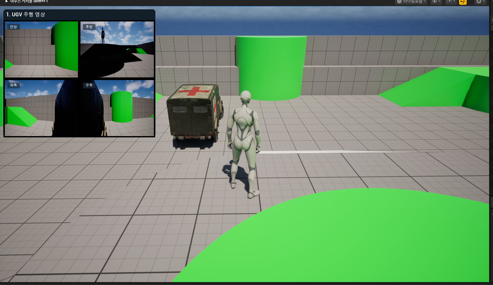
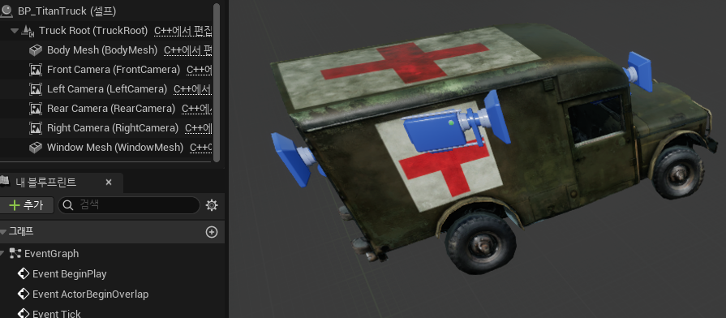
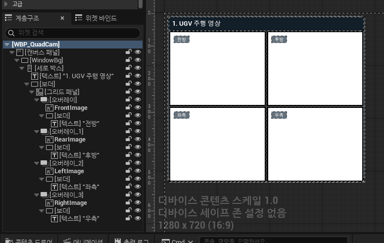
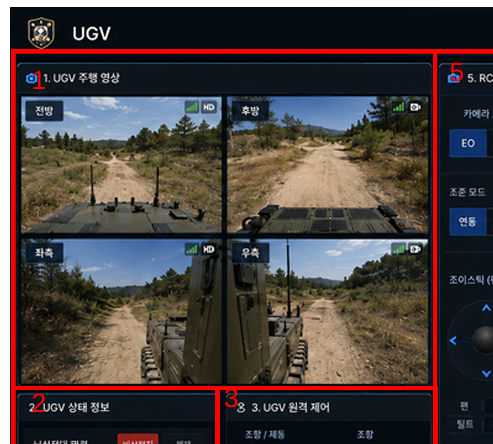

# Titan 트럭 4분할 카메라 — 개발 현황 (2026-06-23)



## 배경
전장 시뮬레이션 프로젝트의 군용 차량 액터("Palantir Titan" 계열) 구현 초기 단계.
Fab 무료 군용 트럭(M725 앰뷸런스) 모델을 베이스로, 4방향 SceneCapture 카메라를 배치하고
Widget Blueprint(통칭 "WBP", 정식 명칭은 **Widget Blueprint**)로 Play 시 뷰포트에
전방/후방/좌측/우측 4분할 영상을 띄우는 기능을 구현했다.

세부 설계/논의 과정은 `titan_quadcam_plan.md` 참고. 이 문서는 실제 구현 결과 정리.
같은 폴더에 스크린샷 4장: `playscreen.png`, `wbp.png`, `bp_titantruck.png`, `reference.png`

## 1. C++ 구현 (완료, 빌드 및 PIE 테스트 통과)

### `Source/titan_example/Vehicles/TitanTruck.h/.cpp` — `ATitanTruck`
- 베이스 메시: Fab `Retextured_M725_Military_Ambulance_00` 에셋의 StaticMesh 2개
  - 본체: `Object003_Material__24_0` → `BodyMesh`
  - 창문: `Object003_001_Material_001_0` → `WindowMesh`
- 원본 메시가 약 100배 크게 임포트되어 있어 `MeshScale = 0.03`으로 보정
  → 실제 크기 약 4.9m × 2.0m × 2.2m (M725 앰뷸런스 실측에 근사)
- `USceneCaptureComponent2D` 4개: `FrontCamera`, `RearCamera`, `LeftCamera`, `RightCamera`
  - 카메라 위치/회전을 코드에서 강제하지 않도록 변경 — 생성자에서 초기값만 세팅하고,
    실제 배치는 `BP_TitanTruck` 에디터 뷰포트에서 직접 드래그로 조정하는 방식으로 확정
  - Left/Right 카메라는 **차량 정면 기준** ±15° Yaw 오프셋으로 시작값 설정
- `BeginPlay`: 카메라별 `UTextureRenderTarget2D` 4개를 동적 생성(기본 480x270)하여
  SceneCapture에 연결 → `QuadCamWidgetClass`로 위젯 생성 후 `AddToViewport()`

### `Source/titan_example/UI/QuadCamWidget.h/.cpp` — `UQuadCamWidget`
- Widget Blueprint의 C++ 부모 클래스
- `FrontImage`/`RearImage`/`LeftImage`/`RightImage` 4개 `UImage*`를 `BindWidgetOptional`로 노출
  (실제 레이아웃/디자인은 Widget Blueprint 쪽에서 담당)
- `SetRenderTargets()`: `FSlateBrush::SetResourceObject()`로 각 RenderTarget을 Image 브러시에
  직접 바인딩. UMG의 `SetBrushFromTexture()`는 `UTexture2D`만 받아서 `UTextureRenderTarget2D`에는
  못 쓰기 때문에 이 방식을 사용함.

### 빌드 설정
- `titan_example.Build.cs`: `SlateCore` 모듈 의존성 추가 (`FSlateBrush` 사용 때문 — 누락 시 링크 에러),
  `Vehicles`/`UI` 폴더를 `PublicIncludePaths`에 추가

## 2. 콘텐츠

### `BP_TitanTruck`
`ATitanTruck` 상속 블루프린트. 카메라 4개를 뷰포트에서 직접 드래그로 배치 완료
(적십자 마크 앰뷸런스 차체에 카메라 4개가 전/후/좌/우로 부착된 상태 확인됨)



### `WBP_QuadCam`
`UQuadCamWidget` 상속 Widget Blueprint. 1차 레이아웃 구성 완료:

```
[캔버스 패널] (루트)
 └ [WindowBg] (Border, 창 배경)
    └ [세로 박스]
       ├ 제목 텍스트 "1. UGV 주행 영상" (Border로 감싼 타이틀 바)
       └ [보더] → [그리드 패널] (2x2)
            └ 셀마다 [오버레이]:
               ├ Image (FrontImage / RearImage / LeftImage / RightImage, Fill)
               └ [보더] (반투명 라벨 박스) + [텍스트] ("전방"/"후방"/"좌측"/"우측")
```



- 참고 디자인: UGV 관제 화면류의 4분할 카메라 패널 스타일
  (제목 바 + 라운드 모서리 반투명 라벨 박스 다수 사용)

  
- GridPanel 4분할이 좌상단에 작게 몰리던 문제 → `Column Fill`/`Row Fill` 가중치 설정 +
  각 셀 Slot Alignment를 Fill로 변경하여 해결
- 라운드 모서리는 Brush의 `Draw As = Rounded Box` + `Outline Settings > Corner Radii`로 적용
  (Border/Image 공통 적용 가능)

## 3. 동작 확인
PIE(Play In Editor) 실행 시 뷰포트 좌측 상단에 4분할 카메라 영상이 정상적으로 표시됨.
4분할 캡처/표시 파이프라인 자체는 정상 동작 확인됨.


## 4. 형상관리 (Perforce)
- 신규 C++ 파일(`TitanTruck.*`, `QuadCamWidget.*`)과 신규 콘텐츠(`BP_TitanTruck`, `WBP_QuadCam`)는
  Submit 완료
- `titan_example.Build.cs`는 기존 추적 파일이라 Checkout 후 수정, 같이 Submit
- `.p4ignore` 추가하여 `Binaries/Intermediate/Saved/DerivedDataCache` 등 빌드 산출물을
  Reconcile/Add 대상에서 제외

## 다음 단계 (미완료)
- `WBP_QuadCam` 디테일 디자인 마무리 (라벨 박스 스타일, 신호/HD 아이콘 등 레퍼런스 이미지 수준으로 다듬기)
- 카메라 위치/FOV 최종 튜닝 (현재는 수동 드래그로 잡은 초기 상태, 실제 주행 시야 기준 검증 필요)
- 트럭 이동/조작 기능 없음 (현재는 정적 배치 + 카메라 표시만; 추후 주행 로직은 별도 작업)

## 참고: 조사했으나 무관했던 것
`C:\working\TankSim` 프로젝트에 비슷한 기능이 있다는 정보를 받아 전체 소스(31개 파일) 확인했으나,
재사용 가능한 4분할 카메라 구현은 없었음 (`GenesisViewerBridge.cpp`는 외부 물리 시뮬레이터 연동,
`MinimapCaptureActor`는 단일 미니맵, `TankSimViewportClient`는 YOLO 오버레이 + 창모드 토글용).
→ 본 기능은 TankSim 참고 없이 새로 구현함.
